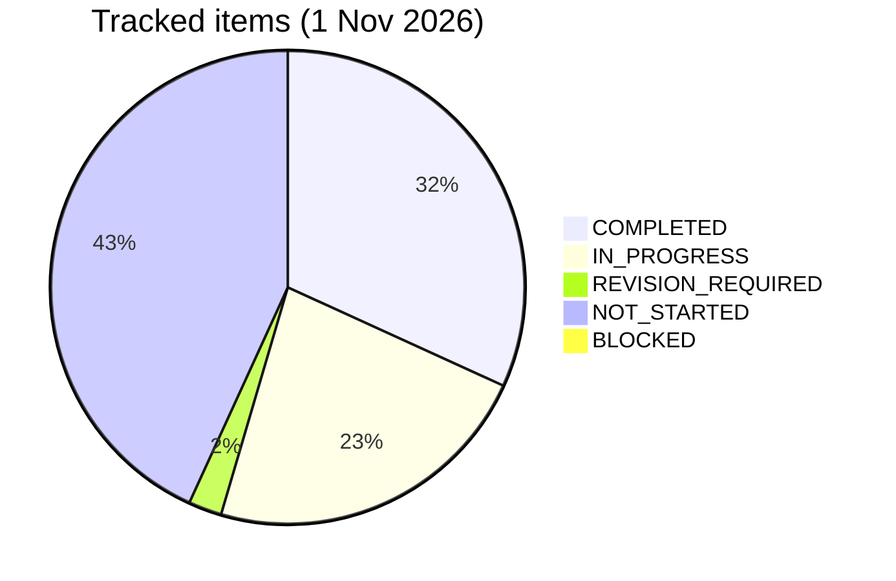

# 📈 Progress Log

   

> [!IMPORTANT]
> The single progress tracker, organised around the three tracks of [docs/PROGRAM.md](docs/PROGRAM.md): 🏦 Spring Boot banking project, 🧩 DSA (NeetCode by pattern) and 🐞 buggy problems, plus spaced repetition. Nothing is ✅ COMPLETED unless my own work is in the repo and verified. Progress, not the calendar, decides the next task.

> [!NOTE]
> **Legend:** ⬜ `NOT_STARTED` · 🟡 `IN_PROGRESS` · ✅ `COMPLETED` (verified) · 🔴 `REVISION_REQUIRED` · ⛔ `BLOCKED` · 🔥 active · 🧩 DSA · 🐞 buggy · 🏦 banking · 🌱 Spring · 🔁 redo. Old names map: Completed and verified → COMPLETED; Needs correction → REVISION_REQUIRED; Attempted / In progress / Ready for revision → IN_PROGRESS; Not started → NOT_STARTED. The Log at the bottom keeps the words it was written with.

## 🧭 Overall status
| Track | Status | Verified so far | Open now | Next |
|---|---|---|---|---|
| 🏦 **Spring Boot banking** | 🟡 IN_PROGRESS | foundation: `course-practice` Part A and B1 ✅; Day 04 Q1-Q3 re-answers ✅ (26/30); banking setup (milestone 0) ✅; **0 of 10 modules** started | Part B2 (🟡 18/18 green, but the catch-all 500 handler is still wrong), module 1 | [B2](tasks/day10.md#-day-04-part-b2-problemdetail-in-every-error-response), then [module 1](tasks/day09.md#-banking-module-1-authn--authz-foundation) |
| 🧩 **DSA, Stack pattern** | 🟡 IN_PROGRESS | 6 problems ✅ (3 of the 7 NeetCode Stack problems); `CarFleet` ✅ 3 Nov (37/37, with hints) | the 3 comment lines on `CarFleet`, count-stack re-ask; next new Stack problem only when the open items clear | [Midday push review](tasks/day12.md#-midday-push-review-3-nov-1737-ist) |
| 🐞 **Buggy rounds** | 🟡 IN_PROGRESS | 3 rounds ✅ | `Day04LargestRectangle`, `Day00BuggyExample` | [Largest Rectangle](tasks/day09.md#-day04largestrectangle-buggy-round) |
| 🔁 **Spaced repetition** | 🟡 IN_PROGRESS | 3 cold redos ✅ | 8 problems on the ladder, 2 redos due Wed 4 Nov evening (moved from 1, 2 and 3 Nov, blank stubs ready) | [day11.md](tasks/day11.md#-due-redos-2-in-the--evening-after-the-review-and-pending-work) |
| 🎤 **Interview Q&A** | 🟡 IN_PROGRESS | Day 02-04 graded (5/7/5, 5/5/7, 5/4/6); Day 04 re-answers 8/9/9 (26/30) ✅ | `ScoreOfParentheses` follow-ups, Day 02 and Day 03 re-answers | [interview-answers.md](interview-answers.md) |

> [!TIP]
> The day is 2 h morning (all new work: Spring about 50 min, DSA about 35, buggy about 15) plus 1 h evening (review and score each track out of 10, finish pending work, then redos). Details: [docs/PROGRAM.md](docs/PROGRAM.md). Specs of every pending task: [tasks/day09.md](tasks/day09.md) and Part B2 in [tasks/day10.md](tasks/day10.md#-day-04-part-b2-problemdetail-in-every-error-response); today's plan: [tasks/day11.md](tasks/day11.md).

```bash
mvn test          # root project: DSA and buggy rounds
```

## 🗂️ Layout
| | Path | What |
|---|---|---|
| 🧭 | `docs/PROGRAM.md`, `docs/STYLE-GUIDE.md` | operating model; markdown and spec style |
| 🧩 | `src/main/java/com/prashant/dsa/<pattern>/` | DSA solutions, tests in `src/test/java/...` |
| 🐞 | `src/main/java/com/prashant/dailytests/` and `.../redo/` | buggy rounds and redos, tests in `src/test/java/...` |
| 🏦 | `banking-app/` | the banking project ([design](banking-app/project-architecture.md)) |
| 🌱 | `spring-boot/` | `course-practice`, the revision workbook, `prerequisites.md`, graded answers |
| 📋 | `tasks/` | one file per day, `dayNN.md` |
| 🔁 | `revision/` | `redo-schedule.md`, `mistakes/dsa.md`, `mistakes/spring.md`, index `mistake-log.md` |
| 🗄️ | `archive/` | retired SQL and the early `day02-05-morning` files ([archive/README.md](archive/README.md)) |

## 🏦 Spring Boot track
### 🧱 Banking modules (the project)
> [!NOTE]
> Order follows the concepts each module introduces ([project-architecture.md](banking-app/project-architecture.md)). A module is ✅ COMPLETED only after its tests pass and the review has read the code. Milestone 0 (setup: Docker Postgres 5433, Flyway V1, health UP) is ✅ COMPLETED (24 Oct).

| # | Module | Concepts introduced | Status |
|---|---|---|---|
| 0 | Setup | Docker, Flyway V1, two DB roles, Testcontainers | ✅ COMPLETED |
| 1 | AuthN / AuthZ | Flyway V2, password hashing, JWT issue and verify, `@PreAuthorize` | ⬜ NOT_STARTED (starts after Part B2 is ✅) |
| 2 | Customer | JPA entities, validation, KYC maker-checker | ⬜ NOT_STARTED |
| 3 | Account | `NUMERIC` money, ownership checks, `@Version`, pagination | ⬜ NOT_STARTED |
| 4 | Beneficiary | uniqueness rules, soft delete, `Clock` | ⬜ NOT_STARTED |
| 5 | Transactions | `@Transactional`, optimistic vs pessimistic locking | ⬜ NOT_STARTED |
| 6 | Fund Transfers | lock ordering, idempotency, conflicts | ⬜ NOT_STARTED |
| 7 | Transaction History | projections, keyset pagination, N+1 | ⬜ NOT_STARTED |
| 8 | Notifications | domain events, `@TransactionalEventListener`, async | ⬜ NOT_STARTED |
| 9 | Statements / Reports | scheduling, batch reads, file generation | ⬜ NOT_STARTED |
| 10 | Audit / Compliance | append-only audit, trigger, `REVOKE` | ⬜ NOT_STARTED |

### 🌱 Foundation: `course-practice` and the Spring sections
| Section | Status | Evidence |
|---|---|---|
| §1 Core: IoC, DI, beans | 🟡 IN_PROGRESS | Day 02 answers 5/7/5; revision pending |
| §2 Request flow | 🟡 IN_PROGRESS | Day 04 Q1 5/10, re-answered 8/10 on 1 Nov ✅ |
| §3 Request mapping | 🟡 IN_PROGRESS | code verified 28 Oct, `course-practice` 12/12; Q3 7/10; revision pending |
| §4 HTTP semantics | 🟡 IN_PROGRESS | code verified 28 Oct; Day 03 Q1/Q2 5/10; revision pending |
| 🔥 §5 Validation and error handling | 🟡 IN_PROGRESS | Part B1 ✅ (31 Oct, 15/15); B2 🟡 (2 Nov late push `0600df2` + Lumi's minor fixes `3d85c55`: `course-practice` 18/18, malformed-body handler and 3 tests in; open: the `Exception.class` catch-all turns 405, 415 and a bad id into a 500 with a wrong message); Day 04 Q1-Q3 re-answered 26/30 ✅ |
| §6 JPA · §7 Testing · §8 Config | ⬜ NOT_STARTED | taught inside the banking modules (JPA with modules 2-3, testing with every module, config with module 1); their workbook sections are answered when each is reached |

| `course-practice` task | Status | Notes |
|---|---|---|
| Day 02 endpoints | ✅ COMPLETED | rolled into Part A, verified with it |
| Day 03 / Day 04 Part A (endpoint fixes) | ✅ COMPLETED (28 Oct) | 11dfcc8 → 27b70d6 → bddf14c → af4f8e7 → 6e3d6be → c047571; `course-practice` 12/12; see [day06.md](tasks/day06.md) |
| Day 04 Part B1 (`@Size` message, `exists...` queries, 409, +2 tests) | ✅ COMPLETED (31 Oct) | 71a5f07 + c344203; `course-practice` 15/15 (`StudentControllerTest` 14 + context 1). Open note: no unique constraint on `email` yet (the race), a JPA topic |
| Day 04 Part B2 (`ProblemDetail` everywhere, malformed JSON 400, +3 tests) | 🟡 IN_PROGRESS | [spec](tasks/day10.md#-day-04-part-b2-problemdetail-in-every-error-response). `f4cb8b9`: `notFound`, `invalid`, `missingParameter`, `handleDuplicateEmail` return `ProblemDetail`; `0600df2` (2 Nov, 22:35 IST) added the `HttpMessageNotReadableException` handler with a fixed `detail` and a log line, moved the 4 assertions and added 3 tests (16/18 as pushed); Lumi's minor fixes `3d85c55` make it **18/18**. Still open (conceptual, yours): the `Exception.class` catch-all returns a 500 for 405, 415 and a non-numeric id, with the wrong `detail`/`errorCode` |

## 🧩 DSA track (NeetCode 150 by pattern)
> [!NOTE]
> Pattern order from [neetcode.io/practice](https://neetcode.io/practice). The next pattern starts only when every problem of the current one is ✅ COMPLETED. Stub tests that pass by accident (an empty-input case on an empty method) do not count.

| Pattern | Status | Detail |
|---|---|---|
| Arrays & Hashing · Two Pointers · Sliding Window | ⬜ NOT_STARTED | skipped for now; the program started at Stack |
| 🔥 **Stack** (current) | 🟡 IN_PROGRESS | Valid Parentheses ✅ · Min Stack ✅ · Car Fleet ✅ (3 Nov, with hints) · Evaluate RPN, Generate Parentheses, Daily Temperatures, Largest Rectangle ⬜ not yet assigned as DSA problems |

| Problem | Tests | My commit | Status | Notes |
|---|---|---|---|---|
| ValidParentheses | 2/2 | starter | ✅ COMPLETED | on the redo ladder |
| MinStack | 10/10 | 156a339 | ✅ COMPLETED | on the redo ladder |
| ScoreOfParentheses | 37/37 | c909bb8 | ✅ COMPLETED | follow-up questions ⬜ NOT_STARTED (answers pending) |
| RemoveKAdjacentDuplicates (Day 01) | 26/26 | 2d36911 | ✅ COMPLETED (29 Oct) | O(n) quiz 3/5 (missed the push/pop-once reasoning) → re-ask 🔴 |
| AsteroidCollision (Day 02) | 28/28 | 6ddde32 + Lumi's cosmetic clean-up | ✅ COMPLETED (31 Oct) | O(n) stack, `long` for `Integer.MIN_VALUE`, input not modified |
| CarFleet (Day 04) | 37/37 | 91cb817 + Lumi's minor fixes | ✅ COMPLETED (3 Nov, with hints) | sort by position descending, cross-multiplied `long` comparison, `Deque<long[]>`; hint-assisted (pairing, exact comparison). Still owed: pattern line and time/space comments at the top · [review](tasks/day12.md#-midday-push-review-3-nov-1737-ist) |

## 🐞 Buggy problems (on the current pattern: Stack)
| Round or redo | Type | Tests | My commit | Status | Notes |
|---|---|---|---|---|---|
| Day01ArrayStack | 🐞 buggy | 17/17 | 71ae03f | ✅ COMPLETED | fixed with hints; on the redo ladder |
| Day02RpnEvaluator | 🐞 buggy | 44/44 | 1f1be84 | ✅ COMPLETED | fixed with a hint on `-3`; on the redo ladder (reset to +1) |
| Day03NextGreaterIndex | 🐞 buggy | 37/37 | 2d36911 + bcb37f3 | ✅ COMPLETED (29 Oct) | both bugs found; stray `main()` repeated and removed |
| Day04LargestRectangle | 🐞 buggy | 15/36 | none | ⬜ NOT_STARTED | [spec](tasks/day09.md#-day04largestrectangle-buggy-round) |
| Day00BuggyExample (warm-up) | 🐞 buggy | 4/10 | none | ⬜ NOT_STARTED | [spec](tasks/day09.md#-day00buggyexample-buggy-warm-up) |
| Day01ArrayStackRedo | 🔁 redo (day 3) | 17/17 | af4f8e7 | ✅ COMPLETED (cold, 28 Oct) | |
| Day01ArrayStackRedo7 | 🔁 redo (day 7) | 17/17 | d5c0ee9 | ✅ COMPLETED (31 Oct) | clean cold pass; Lumi removed stale TODO comments |
| Day02RpnEvaluatorRedo | 🔁 redo (day 3) | 44/44 | bddf14c | 🟡 IN_PROGRESS | passes, but done by re-reading the original, not from memory |
| Day02RpnEvaluatorRedo7 | 🔁 redo (day 7) | 44/44 | 37f6c11 | ✅ COMPLETED (31 Oct) | fixed after 3 review rounds (fall-through, end check, null guard); logged in `revision/mistakes/dsa.md`; reset to +1 |
| Day02RpnEvaluatorRedoNov01 | 🔁 redo (+1) | 0/44 | stub only | 🟡 IN_PROGRESS (assigned 1 Nov) | cold; not attempted 1, 2 or 3 Nov, moved to the Wed 4 Nov evening; tests verified against a correct version |
| ValidParenthesesRedoNov01 | 🔁 redo (+1) | 0/18 | stub only | 🟡 IN_PROGRESS (assigned 1 Nov) | cold; not attempted 1, 2 or 3 Nov, moved to the Wed 4 Nov evening; new stricter suite (empty, `null`, non-brackets, 100 000 chars) |

> [!IMPORTANT]
> 🔁 Every DSA problem and buggy round is redone cold, and each result sets the next gap (clean pass 1 → 3 → 7 → 14 → 30; hint or fix repeats the gap; conceptual miss resets to day 1), at most 2 a day. A problem keeps ✅ COMPLETED for its first verified solve; the calendar and next due dates are in [redo-schedule.md](revision/redo-schedule.md).

## 🎤 Interview Q&A (see [interview-answers.md](interview-answers.md))
| Set | Status | Detail |
|---|---|---|
| Day 01 | ⬜ NOT_STARTED | no graded record |
| Day 02 | 🟡 IN_PROGRESS | 5 / 7 / 5; re-answer Q1, Q3 |
| Day 03 | 🟡 IN_PROGRESS | 17/30 (5 / 5 / 7); re-answer Q1, Q2 · [day03-answers.md](spring-boot/interview-answers/day03-answers.md) |
| Day 04 | ✅ COMPLETED (1 Nov) | first attempt 15/30 (5 / 4 / 6); re-answers 26/30 (Q1 8, Q2 9, Q3 9), graded in chat · [day04-answers.md](spring-boot/interview-answers/day04-answers.md) |
| Score of Parentheses follow-up | ⬜ NOT_STARTED | answers pending |

## 📌 Pending
> [!NOTE]
> Everything not ✅ COMPLETED, in the order to work it. Pending work never disappears until it is verified. Full specs: [tasks/day09.md](tasks/day09.md).

| # | Item | Track | Status |
|---|---|---|---|
| 2 | `CarFleet` pattern line + time/space comments (code ✅ 37/37, 3 Nov) | 🧩 | 🟡 IN_PROGRESS |
| 3 | `Day04LargestRectangle` | 🐞 | ⬜ NOT_STARTED |
| 4 | `Day00BuggyExample` | 🐞 | ⬜ NOT_STARTED |
| 5 | Day 04 Part B2 (18/18 green; fix the catch-all handler, see [day11.md late push review](tasks/day11.md#-late-push-review-2-nov-2235-ist)) | 🌱 | 🟡 IN_PROGRESS |
| 6 | Banking module 1 (AuthN / AuthZ) | 🏦 | ⬜ NOT_STARTED |
| 7 | Redos due Wed 4 Nov (moved from 1, 2 and 3 Nov): `Day02RpnEvaluatorRedoNov01` (0/44), `ValidParenthesesRedoNov01` (0/18) | 🔁 | 🟡 IN_PROGRESS |
| 8 | Count-stack O(n) re-ask (3/5) | 🧩 | 🔴 REVISION_REQUIRED |
| 9 | `ScoreOfParentheses` follow-up questions | 🧩 | ⬜ NOT_STARTED |
| 10 | Day 02 and Day 03 re-answers (Q1, Q3 / Q1, Q2) | 🌱 | 🟡 IN_PROGRESS |

## 🎯 Weak topics
> [!NOTE]
> Classified from graded evidence so far, using the rubric in [docs/PROGRAM.md](docs/PROGRAM.md) (Strong 8-10, Moderate 6-7, Weak 0-5). The first scored evening review refreshes this table; a **weak-topic pack** (notes, 1 conceptual question, 1 implementation, 1 debugging, 1 interview scenario) is generated for each 🔴 Weak row when it is picked up.

| Track | Topic | Evidence | Class | Pack |
|---|---|---|---|---|
| 🌱 | DTO vs entity (what leaks, mass assignment) | Day 04 Q2 4/10, re-answer 9/10 (1 Nov) | 🟢 Strong | ⬜ not generated |
| 🌱 | JSON → validated DTO: which exception at which step | Day 04 Q1 5/10, re-answer 8/10 (1 Nov) | 🟢 Strong | ⬜ not generated |
| 🌱 | HTTP semantics: idempotency, DELETE twice, PUT vs PATCH, status codes | Day 02 Q3 5/10, Day 03 Q1 5/10 | 🔴 Weak | ⬜ not generated |
| 🌱 | `ResponseEntity` vs `@ResponseStatus`, `Location` header | Day 03 Q2 5/10 | 🔴 Weak | ⬜ not generated |
| 🌱 | `@PathVariable` / `@RequestParam` / `@RequestBody` | Day 02 Q1 5/10 | 🔴 Weak | ⬜ not generated |
| 🌱 | Race on unique data: check-then-save vs a DB constraint | Day 04 Q3 6/10, re-answer 9/10 (1 Nov) | 🟢 Strong | ⬜ not generated |
| 🧩 | Amortised O(n) reasoning for stack solutions | count-stack quiz 3/5; re-ask still open (1 Nov) | 🔴 Weak | ✅ generated 1 Nov ([day10.md evening](tasks/day10.md#-weak-topic-pack-amortised-on-for-stack-solutions)), open after the re-ask |
| 🧩🐞 | RPN evaluation: operand order, `"-3"` token, end check, null guard | 3 conceptual misses on 31 Oct (day-7 redo) | 🔴 Weak | ⬜ not generated |
| 🐞 | Array-backed stack boundaries (grow check, empty, capacity 0) | clean cold redo 28 Oct and 31 Oct | 🟢 Strong | none needed |
| 🌱 | §5 `ProblemDetail` error contract (Part B2) | 1 Nov evening 7/10: four handlers clean, but the contract changed without its tests (`main` 11/15) and the malformed-body handler is missing | 🟡 Moderate (weakest: implementation 6) | none (Moderate) |
| 🌱 | Catch-all `@ExceptionHandler(Exception.class)` and what it swallows (405, 415, type mismatch) | 2 Nov late push: the handler returns a 500 with a copy-pasted message and no log; Q6 of the B2 interview questions is the same gap | 🟡 Moderate (concept 6) | none (Moderate) |

### 📝 Evening scores (out of 10, rubric in [PROGRAM.md](docs/PROGRAM.md#-evening-scoring-rubric))
| Date | 🌱 Spring | 🧩 DSA | 🐞 Buggy | Evidence |
|---|---|---|---|---|
| Sun 1 Nov | **7** (concept 8 · implementation 6 · problem solving 7 · interview 7) | not scored, no work | not scored, no work | Day 04 re-answers 26/30; `f4cb8b9` four `ProblemDetail` handlers, `course-practice` 11/15; `CarFleet` 2/37 and `Day04LargestRectangle` 15/36 untouched · [day10.md evening](tasks/day10.md#-evening-1-nov-review-scores-and-tonights-work) |
| Mon 2 Nov | not scored, no work | not scored, no work | not scored, no work | no pushes from Prashant today (only the 6 AM session commit `f1dd0e5`); all suites unchanged (`course-practice` 11/15, `CarFleet` 2/37, `Day04LargestRectangle` 15/36, redos 0/44 and 0/18) · [day11.md evening](tasks/day11.md#-evening-2-nov-review-scores-and-tonights-work) |
| Mon 2 Nov, late push (22:35 IST) | **6** (concept 6 · implementation 6) | not scored, no work | not scored, no work | `0600df2`: B2 handler, 4 assertions moved, 3 tests; as pushed 16/18; with Lumi's minor fixes `3d85c55` 18/18; catch-all handler is a conceptual miss; `CarFleet`, `Day04LargestRectangle` and both redos untouched · [day11.md late push review](tasks/day11.md#-late-push-review-2-nov-2235-ist) |
| Tue 3 Nov, midday push (17:37 IST) | not scored, no work | **7** (concept 8 · implementation 8 · problem solving 6) | not scored, no work | `91cb817`: `CarFleet` 2/37 → **37/37** (clean `long` cross-multiply, sorted copy, input untouched); needed several hints for the pairing and the exact comparison; complexity not stated yet (skipped); `course-practice` 18/18, `Day04LargestRectangle` 15/36, redos 0/44 and 0/18 unchanged · [day12.md midday push review](tasks/day12.md#-midday-push-review-3-nov-1737-ist) |
| Tue 3 Nov, evening review (8 PM) | not scored, no work | **7** (unchanged, no new evidence since `91cb817`) | not scored, no work | `CarFleet` 37/37 re-verified; `course-practice` 18/18 (catch-all open), `Day04LargestRectangle` 15/36, redos 0/44 and 0/18; no pushes after 17:37 IST; owed: 3 comment lines, catch-all fix, symptom table · [day12.md evening](tasks/day12.md#-evening-3-nov-review-scores-and-tonights-work) |

## 🔁 Revision schedule
Full calendar and rules: [revision/redo-schedule.md](revision/redo-schedule.md). Conceptual mistakes: [mistakes/dsa.md](revision/mistakes/dsa.md), [mistakes/spring.md](revision/mistakes/spring.md) (no single mistakes file).

| Date | Redo 1 | Redo 2 |
|---|---|---|
| Wed 4 Nov | `Day02RpnEvaluator` (+1, late) | `ValidParentheses` (+1, late) |
| Thu 5 Nov | `MinStack` (+1, late) | `ScoreOfParentheses` (+1, late) |
| Fri 6 Nov | `RemoveKAdjacentDuplicates` (+1, late) | `Day03NextGreaterIndex` (+1, late) |
| Sat 7 Nov | `AsteroidCollision` (+1, late) | `Day02RpnEvaluator` (+3) |
| Sun 8 Nov | `Day01ArrayStack` (+7, late) | `ValidParentheses` (+3, late) |
| Mon 9 Nov | `MinStack` (+3, late) | `ScoreOfParentheses` (+3, late) |
| Tue 10 Nov | `RemoveKAdjacentDuplicates` (+3, late) | `Day03NextGreaterIndex` (+3, late) |

> [!WARNING]
> Redos now run in the 🌙 evening, after the review and after pending morning work. The 1, 2 and 3 Nov redos were not attempted, so the queue has moved three days in total (last graduation now Mon 4 Jan, with `CarFleet` queued to Wed 11 Nov). In the next 7 days (4-10 Nov) they are 14 redos (about 5.8 h) against a 7 h evening budget, so there is almost no spare evening time that week; the cap of 2 a day and the "most overdue first" rule decide what waits.

## ⛔ Blockers
| Blocker | Since | Needs |
|---|---|---|
| none | | |

> [!NOTE]
> Waiting is not blocking: banking module 1 starts when Part B2 is ✅ (a dependency in the plan, not an outside obstacle). Open decisions for Prashant: where the `Beneficiary`, `Notification` and `Report` features live in the package layout (before module 4), and whether the cap of 2 redos a day stays when the evening is short.

## ▶️ Next recommended tasks
> [!IMPORTANT]
> **Tomorrow (Wed 4 Nov, 6 AM), set by the 10 PM check ([day12.md end of day](tasks/day12.md#-end-of-day-3-nov-10-pm-check)).** No pushes after the 8 PM review, so everything carries. In order, push after each:
> 1. 🌅 🧩 `CarFleet`: the pattern line and time/space as 3 comment lines at the top of `CarFleet.java` (5 minutes, *hint:* which step dominates, and what does the stack hold in the worst case?), **pushed first**; `CarFleetTest` stays 37/37.
> 2. 🌱 Part B2: answer the three guiding questions of the `Exception.class` catch-all, fix or remove it, add one 415 or 405 test and the sixth assertion on `malformedJsonReturnsProblemDetail` (19 or more tests, 0 failures).
> 3. 🐞 `Day04LargestRectangle` symptom table (21 failing tests by group), then the smallest fix per group.
> 4. 💬 In chat: the `CarFleet` single-pair follow-up, the count-stack O(n) re-ask, and Q3 and Q6 of the B2 interview questions.
> 5. 🌙 Evening: review, then the cold redos `Day02RpnEvaluatorRedoNov01` (0/44) and `ValidParenthesesRedoNov01` (0/18); if they slip again, `MinStack` and `ScoreOfParentheses` stay next in line (5 Nov).
>
> Banking module 1 starts only after B2 is ✅. Ask for a hint after 15 minutes on any step.

## 📊 Status counts

```mermaid
pie title Tracked items (1 Nov 2026)
  "COMPLETED" : 14
  "IN_PROGRESS" : 10
  "REVISION_REQUIRED" : 1
  "NOT_STARTED" : 19
  "BLOCKED" : 0
```

| Track | ✅ COMPLETED | 🟡 IN_PROGRESS | 🔴 REVISION_REQUIRED | ⬜ NOT_STARTED | ⛔ BLOCKED | Items |
|---|---|---|---|---|---|---|
| 🧩 DSA problems | 5 | 0 | 0 | 1 | 0 | 6 |
| 🐞 Buggy rounds | 3 | 0 | 0 | 2 | 0 | 5 |
| 🔁 Redo files | 3 | 3 | 0 | 0 | 0 | 6 |
| 🌱 Spring foundation (8 sections + 3 `course-practice` tasks) | 2 | 5 | 0 | 4 | 0 | 11 |
| 🏦 Banking (milestone 0 + 10 modules) | 1 | 0 | 0 | 10 | 0 | 11 |
| 🎤 Q&A sets | 0 | 2 | 1 | 2 | 0 | 5 |
| **Total** | **14** | **10** | **1** | **19** | **0** | **44** |

> [!NOTE]
> Counted from the tables on this page on 1 Nov 2026. The earlier tally (27 items, 31 Oct) did not list the ten banking modules or the redo files separately, so the totals are not comparable; the old statuses were mapped by the rule in the legend.

## 🔮 Plan projection (3 h a day)
> [!WARNING]
> **Estimate, not a promise.** Built from this file, the [redo schedule](revision/redo-schedule.md) and the `tasks/` files, using the pace of the first 9 days. It is **refreshed every Sunday by the 10 PM check** (this one: Sun 1 Nov 2026, 10 PM, W2 D10, from data through 1 Nov; next: Sun 8 Nov). Weeks count from 23 Oct: W1 = 23-29 Oct, W2 = 30 Oct-5 Nov, W3 = 6-12 Nov, W4 = 13-19 Nov, W5 = 20-26 Nov, W8 = 11-17 Dec, W10 = 25-31 Dec, W12 = 8-14 Jan 2027, W22 = 19-25 Mar 2027.

### 📊 Verified per week (measured, 23 Oct-1 Nov, 10 days)
| Week | Dates | 🧩 DSA | 🐞 Buggy | 🌱 Spring | 🏦 Banking | Total | 🔁 Cold redos (separate) |
|---|---|---|---|---|---|---|---|
| W1 | 23-29 Oct | 4 | 3 | 1 | 1 | 9 | 1 |
| W2 (3 of 7 days) | 30 Oct-1 Nov | 1 | 0 | 2 | 0 | 3 | 2 |
| **Total** | 10 days | **5** | **3** | **3** | **1** | **12** | **3** |
| Pace per week (total × 7 / 10) | | 3.5 | 2.1 | 2.1 | 0.7 | 8.4 | 2.1 |

> [!NOTE]
> New since the 1 Nov restructure count: the 🌱 Day 04 Q&A set (re-answers 26/30, ✅ 1 Nov). Part B2 is 🟡 (11/15) and does not count yet. 1 Nov added no DSA, buggy or redo item, so the measured pace dipped from 8.6 to 8.4 a week; the open DSA and buggy items (`CarFleet`, `Day04LargestRectangle`) have not been started in the program's first day.

### ⏱️ What 3 hours a day changes (and what it does not)
| | Minutes a day | Per week | Compared with the measured period |
|---|---|---|---|
| 🌱 Spring slot | 50 | 350 | about the same as the old morning slot (60 minus 10-15 of revise-first) |
| 🧩 DSA slot | 35 | 245 | the same as the old evening DSA slot |
| 🐞 Buggy slot | 15 | 105 | the same, but now its own slot |
| 🌙 Evening | 60 | 420 | review about 10 min a day; the rest is redos (average 25 min a day in November) and pending work |
| **Spare evening time for pending work** | **about 25 on average** | about 175 | **this is the real gain**: about +25% on the morning's 100 min, and zero in the first redo-heavy week |

> [!IMPORTANT]
> Three hours a day does **not** triple the pace. The morning new-work slots are about as long as before, and the extra evening hour is mostly taken by review and redos. The gain is only the spare evening time that lets an unfinished morning task be finished the same day. **Best case** counts that spare time (×1.25 from week 2). **Slow case** assumes no spare time, half the measured pace for DSA and buggy, and double the effort for Spring and banking.

### 🧮 What remains
| Section | Done | Left | Detail |
|---|---|---|---|
| 🧩 Stack pattern | 3 NeetCode problems ✅ (+3 extras) | **4** | Evaluate RPN, Generate Parentheses, Daily Temperatures, Largest Rectangle |
| 🧩 NeetCode 150 | 3 | **147** | `ScoreOfParentheses`, `RemoveKAdjacentDuplicates`, `AsteroidCollision` are extras, not among the 150 |
| 🐞 Buggy rounds | 3 | **2 existing + about 4 new** | the program adds about one round per new Stack problem |
| 🌱 Spring foundation | Part A, B1, Day 04 Q&A | **about 7 Spring slots** | finishing B2, the Day 02 / Day 03 re-answers and the revision passes of §1-§5 (§6-§8 are taught inside the banking modules) |
| 🏦 Banking | milestone 0 | **10 modules** | 0 started; the old plan had 4 milestones, the four new modules (Beneficiary, Transaction History, Notifications, Statements) are new scope |

### 🎯 Estimated finish
| Section | Pace (best / slow, per week) | Finish week (range) | Dates |
|---|---|---|---|
| 🧩 Stack pattern (5 left) | 4.4 / 1.75 | **W3-W5** | 10-21 Nov |
| 🐞 Buggy rounds (about 6) | 2.6 / 1.05 | **W4-W8** | 18 Nov-11 Dec |
| 🧩 Full NeetCode 150 (148 left) | 4.4 / 1.75 | **not inside the 12 weeks**; by W12 about **20-48 of 150** | best case about end of June 2027 |
| 🌱 Spring foundation (7 slots best, 14 slow) | 8.75 / 7 slots | **W3-W4** | 8-15 Nov |
| 🏦 Banking, 10 modules (63 slots best, 126 slow) | 8.75 / 7 slots (50 min each) | **W10-W22** | 29 Dec-21 Mar |
| ⭐ **Overall** (everything except the full NeetCode 150) | set by banking | **W10-W22** | 29 Dec 2026-21 Mar 2027 · the 12-week target (W12, 14 Jan) is met only at the best end |

> [!IMPORTANT]
> **Assumptions**
> - Pace is the measured 10-day average (12 verified items, 8.4 a week), counted from 2 Nov. Best = measured pace × 1.25 (spare evening time). Slow for DSA and buggy = half the measured pace (a plain rule, not data: the old slow figure, 1.2 a week, cannot be reproduced from this file). Slow for Spring and banking doubles the effort instead (126 + 16 slots at 7 slots a week), so the slowness is not counted twice.
> - Banking effort is a guess, since 0 of 10 modules are started: the old plan's 10.5 Spring slots per milestone (1.5 weeks) and 21 slow, applied to the 4 old milestones (42 / 84 slots), plus half a milestone for each of the 4 new modules (+21 / +42): **63 / 126 slots**, plus about 7 / 14 slots of foundation. A Spring slot is one morning's 50 minutes.
> - §6 JPA, §7 Testing and §8 Config are absorbed into the banking modules, so they do not add a separate block. If they are kept as separate sections the banking range moves later.
> - Buggy rounds: 2 exist; about 1 new round per new Stack problem is assumed.
> - Redos are separate: 14 in the next 7 days (2-8 Nov, about 5.8 h of the 7 h evening budget), 30 across 2-30 Nov (about 12.5 h, 42% of the evening time, 14% of the total 3 h days), 38 until the 8 scheduled problems graduate (last on 30 Dec, one day later because the 1 Nov redos moved); each new DSA problem adds 5 redos (about 2 h over 30 days).
> - No missed days, 7 working days a week, every redo a clean pass. A conceptual miss resets a problem to day 1 and adds load.
> - **Versus the 1 Nov morning projection (W10-W22, 28 Dec-23 Mar):** about the same; the best end moves 1 day later (one day with no Spring slot verified) and the slow end 2 days earlier (one foundation slot fewer). Stack moves from W3-W4 to W3-W5 because the measured DSA pace fell from 3.9 to 3.5 a week.
> - **Versus the 31 Oct projection (W10-W17):** the best end is in the same week (28 Dec vs 25 Dec, both W10) and the slow end moves about 5 weeks later (23 Mar vs 18 Feb), because the banking scope grew from 4 milestones to 10 modules while the Spring slot did not get longer.

## 🗄️ Archive
> [!NOTE]
> **SQL was retired on 31 Oct 2026**: SQL files, the SQL mistake log, the SQL checker and the SQL interview questions (none were left in the active files) are kept in [archive/](archive/README.md). It is no longer assigned, tracked, graded or counted. Database topics come back only as Spring/JPA/Flyway questions. The four early `day02-05-morning` task files are archived there too (1 Nov 2026).

## 📝 Log
| Date | Week/Day | Done | Notes |
|------|----------|------|-------|
| 23 Oct 2026 | W1 D1 | Valid Parentheses (understood); Min Stack done, 10/10 tests passing | Two-stack approach, O(1) ops. Next: space-optimized version (push to mins only when x <= min) |
| 25 Oct 2026 | W1 D3 | ScoreOfParentheses 37/37 (c909bb8) | Got help writing; dry-ran line by line. Follow-up Qs pending |
| 26 Oct 2026 | W1 D4 | Day 03 Spring Part A pushed (11dfcc8) | Needs correction: /search, DELETE 204, tests |
| 26 Oct 2026 | — | Backlog reconciliation | This file + interview-answers.md |
| 27 Oct 2026 | W1 D5 | Morning round assigned (backlog only) | Day 03 Part A corrections + Day02 RPN redo stub. No new buggy round (Day 03/04 unattempted), no new Spring task (§3/§4 open) |
| 27 Oct 2026 | W1 D5 | Spring Part A mostly fixed (27b70d6, bddf14c); RPN redo 44/44 but not from memory | Evening: backlog only — RemoveKAdjacentDuplicates + SQL 03 Q1. Verified with `mvn test` (328 tests; my finished classes all green) |
| 27 Oct 2026 | W1 D5 | 10 PM check: no new pushes after the evening assignment | `RemoveKAdjacentDuplicates` still 0/26, no `sql/day03-answers.md`; both carried to Day 06 evening. Re-verified: Day02RpnEvaluator 44/44, Redo 44/44 (🟠 Attempted), StudentControllerTest 9/9 |
| 28 Oct 2026 | W1 D6 | Morning round assigned (backlog only) | Finish Part A (2 tests + 2 clean-ups) + `Day01ArrayStackRedo` stub (0/17, verified 17/17 against a correct version). No new buggy round (Day 03/04 unattempted), no new Spring task (§3/§4 open) |
| 28 Oct 2026 | W1 D6 | Day 03/04 Part A ✅ verified (af4f8e7, 6e3d6be, c047571); `Day01ArrayStackRedo` 17/17 ✅; Day 03 Q&A graded 17/30 | Verified with `mvn test`: `course-practice` 12/12, `Day01ArrayStackRedoTest` 17/17, `Day02RpnEvaluatorTest` 44/44, `Day02RpnEvaluatorRedoTest` 44/44 (still 🟠 Attempted, cold redo 31 Oct). `tasks/` moved to the repo root. §3/§4 Ready for revision (Q1/Q2 5/10); active section is now §5 |
| 28 Oct 2026 | W1 D6 | Evening session assigned (backlog only) | Re-checked at 8 PM: `RemoveKAdjacentDuplicatesTest` 0/26, no `sql/day03-answers.md`. Both assigned again in `tasks/day06.md` (renamed from `day06-morning.md`, now Morning + Evening). No new stub or SQL file (3 DSA not started, 5 SQL unanswered) |
| 28 Oct 2026 | W1 D6 | 10 PM check: no new pushes after the evening assignment | Re-verified with `mvn test`: `course-practice` 12/12, `Day01ArrayStackRedoTest` 17/17, `Day02RpnEvaluatorTest` 44/44, `Day02RpnEvaluatorRedoTest` 44/44. `RemoveKAdjacentDuplicatesTest` still 0/26, no `sql/day03-answers.md`; both carried to Day 07 evening. No new mistakes. Next: Day 04 Part B |
| 29 Oct 2026 | W1 D7 | Morning round assigned (backlog only) | Re-checked: no pushes since cf74132, `course-practice` still green (`StudentControllerTest` 11). Part B split: B1 (`@Size` message, `exists...` queries, 409, +2 tests) + Day 04 Q3 in [day07.md](tasks/day07.md). No new buggy round (Day 03/04 unattempted), no new Spring task (§5 open) |
| 29 Oct 2026 | W1 D7 | ✅ `RemoveKAdjacentDuplicates` 26/26 and `Day03NextGreaterIndex` 37/37 (2d36911, bcb37f3); SQL learn track lessons 01-05 added | 10 PM check: no pushes from me after the 8 PM evening assignment. Part B1 and Day 04 Q3 (morning), `AsteroidCollision` 8/28, SQL 03 Q1 and the `.postman` clean-up (evening) all carried. No new mistakes beyond the two logged this afternoon. Next: Part B1 on 30 Oct 6 AM |
| 30 Oct 2026 | W2 D8 | ✅ SQL learn lesson 01 5/5 (735056a); Spring revision workbook added (d12849e, 9bfb07d); morning round assigned (backlog only) | Ran the lesson 01 checker on a scratch Postgres: `LESSON 01 COMPLETE`, queries reviewed. No Spring push since c047571, so Part B1 is assigned again in [day08.md](tasks/day08.md) with the `Day01ArrayStackRedo7` day-7 redo (stub 0/17, tests verified 17/17 against a correct version). No new buggy round, no new Spring task (§5 open) |
| 30 Oct 2026 | W2 D8 | Evening session assigned (backlog only) | Re-checked at 8 PM with `mvn test`: no pushes since the morning, `AsteroidCollisionTest` 8/28, `Day01ArrayStackRedo7Test` 0/17, `CarFleetTest` 2/37, no `sql/day03-answers.md`. `AsteroidCollision`, SQL 03 Q1 and the `.postman` clean-up assigned in the Evening section of [day08.md](tasks/day08.md). No new stub or SQL file (2 DSA not started, 5 SQL unanswered) |
| 30 Oct 2026 | W2 D8 | 10 PM check: no new verified work | No pushes from me after the 8 PM evening assignment (only Markdown restyle commits today, presentation only). Part B1, `Day01ArrayStackRedo7` (0/17) and Day 04 Q3 carried to 31 Oct morning; `AsteroidCollision` 8/28, SQL 03 Q1 and the `.postman` clean-up carried to 31 Oct evening. No new mistakes. Next: Part B1 on 31 Oct 6 AM |
| 30 Oct 2026 | W2 D8 | 11:40 PM review of 6ddde32 + b26bfc8: `AsteroidCollision` 28/28 and SQL learn lesson 02 5/5, both 🔴 Needs correction (one-line fixes) | Ran `AsteroidCollisionTest` 28/28 and the lesson 02 checker 5/5 (`LESSON 02 COMPLETE`) on a scratch Postgres. Code is correct; review found a stray `+6` in the `AsteroidCollision` Javadoc and a missing `ORDER BY` in lesson 02 ex 1. Still not pushed: Part B1, `Day01ArrayStackRedo7` (0/17), Day 04 Q3, SQL 03 Q1, `.postman` clean-up. Logged in the mistake log |
| 31 Oct 2026 | W2 D8 | 12:15 AM review of f2e5a58 + 71a5f07: ✅ SQL learn lesson 02 5/5; Part B1 pushed, 🔴 Needs correction | Lesson 02 checker 5/5 (ex 1 now has `ORDER BY`). `course-practice` 14/14, `AsteroidCollisionTest` 28/28 but `+6` still in the Javadoc (🔴), `Day01ArrayStackRedo7Test` 0/17. B1: queries, 409 in create/update and 2 tests done; `@Size` has no `message`, no PUT-conflict test. Still pending: Redo7, Day 04 Q3, SQL 03 Q1, `.postman` untracking (both files still tracked, `.gitignore` lacks `postman/globals/`) |
| 31 Oct 2026 | W2 D8 | ✅ `AsteroidCollision` 28/28 after Lumi's cosmetic clean-up; mistake log split per section | Standing rules from Prashant: Lumi fixes cosmetic issues directly (removed `+6` and added braces in `AsteroidCollision`, removed the stale 409 comment in `StudentServiceImpl`); only conceptual mistakes are logged. Re-ran `AsteroidCollisionTest` 28/28 and `course-practice` 14/14. `revision/mistake-log.md` is now an index of `revision/mistakes/dsa.md`, `sql.md`, `spring.md`; the purely cosmetic rows (AsteroidCollision, Day03NextGreaterIndex hygiene) were dropped, all conceptual rows kept with their redo dates. Still his: B1 `@Size` message + PUT-conflict test, `Day01ArrayStackRedo7`, Day 04 Q3, SQL 03 Q1, `.postman` untracking |
| 31 Oct 2026 | W2 D8 | 12:35 AM review of c344203: ✅ Day 04 Part B1 15/15 | `@Size` message added and checked (a 1-char name returns `name must be between 2 and 50 characters`); PUT with another student's email → 409 test added and passing. `course-practice` 15/15. No cosmetic issues found. Still his: `Day01ArrayStackRedo7` (0/17), Day 04 Q3, SQL 03 Q1, `.postman` untracking |
| 31 Oct 2026 | W2 D8 | ✅ Housekeeping: `.postman/` and `postman/globals/` untracked | Done by Lumi at Prashant's request: `.gitignore` now lists `.postman/` and `postman/globals/` (a7ec8aa), and `.postman/resources.yaml` (f0b2c33) and `postman/globals/workspace.globals.yaml` (637e772) were deleted from the repo; `git ls-files` no longer lists them. His local copies are removed by his next `git pull`, so he copies them aside first (see [day08.md](tasks/day08.md)). `spring-boot/course-practice/postman/course-practice-students.postman_collection.json` stays tracked on purpose (a real collection, not workspace metadata) |
| 31 Oct 2026 | W2 D9 | Morning round assigned (backlog only) | Re-checked with `mvn test`: `Day01ArrayStackRedo7Test` 0/17. New stub `redo/Day02RpnEvaluatorRedo7.java` for the cold day-7 RPN redo (0/44, tests checked 44/44 against a correct version). Both in [day09.md](tasks/day09.md). No new buggy round (`Day04LargestRectangle` unattempted, two redos open), no new Spring task (§5 open, B2 next) |
| 31 Oct 2026 | W2 D9 | Review of d5c0ee9: ✅ `Day01ArrayStackRedo7` 17/17; 🔴 `Day02RpnEvaluatorRedo7` 15/44 Needs correction | Ran both suites with `mvn test`. ArrayStack: no conceptual issue. RPN: after an operator the code still runs `Integer.parseInt(token)` (27 `NumberFormatException`/"no result" failures), the end check pops and compares with `1` instead of `size() != 1`, and null/empty input is not guarded. Lumi removed the unused `java.awt.image` import and the stale `TODO` comments in both files. Logged in the DSA mistake log (redo 3 Nov) |
| 31 Oct 2026 | W2 D9 | Review of fe6827d: `Day02RpnEvaluatorRedo7` 43/44, still 🔴 Needs correction | Ran `Day02RpnEvaluatorRedo7Test` with `mvn test`: 43/44. Fall-through fixed with `else`, end check now `stack.size() != 1`, empty array now throws `IllegalArgumentException`. Only `nullArray` fails: `for (String token : tokens)` on a `null` array throws `NullPointerException`; it needs an explicit `tokens == null` check at the top. Chat quiz: he got the stack after `2 3 +` right (5); on the fall-through he first said it pushes the operator token and needed a hint that `parseInt` throws; he explained correctly that `pop()` returns the top value, so `pop() != 1` compares it with 1. No new cosmetic issues |
| 31 Oct 2026 | W2 D9 | Review of 37f6c11: ✅ `Day02RpnEvaluatorRedo7` 44/44 Completed and verified | Ran `Day02RpnEvaluatorRedo7Test` with `mvn test`: 44/44. The null guard `tokens == null \|\| tokens.length == 0` is in, so all three conceptual bugs are fixed. Lumi re-indented the method body and spaced the two helper methods (cosmetic). Redo dates in the DSA mistake log stay (3 Nov, 7 Nov) |
| 31 Oct 2026 | W2 D9 | 🔁 Spaced-repetition calendar added: [revision/redo-schedule.md](revision/redo-schedule.md) | 11 DSA problems and buggy rounds (8 scheduled, 3 not started). Redos at +1, +3, +7, +14, +30 days from the last verified solve, at most 2 a day, most overdue first, a miss resets to +1. Mistake-log dates kept (`RemoveKAdjacentDuplicates` 1 Nov and 5 Nov, `Day02RpnEvaluator` 3 Nov and 7 Nov). Next 7 days: 1 Nov `RemoveK` + `Rpn`, 2 Nov `ValidParentheses` + `MinStack`, 3 Nov `Rpn` + `ScoreOfParentheses`, 4 Nov `Day03NextGreaterIndex` + `AsteroidCollision`, 5 Nov `RemoveK`, 6 Nov `Day01ArrayStack` + `ValidParentheses`, 7 Nov `Rpn` + `MinStack` |
| 31 Oct 2026 | W2 D9 | 🔮 Plan projection added (section above the Log) | 13 verified items in 9 days (DSA 5, buggy 3, SQL 2, Spring 2, banking 1; 3 cold redos on top). Remaining: NeetCode 148, buggy 2, SQL 8, Spring 8 sections, banking 4 milestones. 13 redos in the next 7 days (39% of study time). Estimated finish: Stack W3-W6, buggy W3-W5, SQL W4-W7, Spring W5-W7, banking W10-W17, overall W10-W17 (target W12). Refreshed every Sunday by the 10 PM check |
| 31 Oct 2026 | W2 D9 | 🔁 Redo schedule switched to results-based gaps (approved by Prashant): [revision/redo-schedule.md](revision/redo-schedule.md) | Clean cold pass moves up one step (1 → 3 → 7 → 14 → 30); a hint or fix repeats the gap; a conceptual miss resets to day 1; two clean passes ≥14 days apart skip to 30; max 2 redos a day. Recomputed from real history: `Day01ArrayStack` clean 17/17 → +7, due 7 Nov; `Day02RpnEvaluator` 3 conceptual misses → day 1, due 1 Nov; never-redone items are due since 24-30 Oct and queued. Next 7 days: 14 redos (42% of study time); November 30 redos on 19 days (21%). Plan projection redo load and pace refreshed (Stack W3-W6, NeetCode by W12 about 15-55 of 150) |
| 31 Oct 2026 | W2 D9 | 🎤 Day 04 Q&A answered in chat and graded: 🔴 Needs correction, 15/30 (Q1 5/10 · Q2 4/10 · Q3 6/10) | Saved verbatim in [day04-answers.md](spring-boot/interview-answers/day04-answers.md), linked from [interview-answers.md](interview-answers.md). Q1: missed `MethodArgumentNotValidException` (named the malformed-JSON exception). Q2: vague, mass assignment half-got, missed leaking internal fields or lazy relations and schema coupling. Q3: `ProblemDetail` and 400 vs 409 right, but not the race condition (unique constraint + `DataIntegrityViolationException` → 409). Conceptual rows for Q1 and Q3 added to `revision/mistakes/spring.md` (redo 3 Nov and 7 Nov). Re-answer all three by 3 Nov |
| 31 Oct 2026 | W2 D9 | Evening session assigned (backlog only) | Re-checked at 8 PM with `mvn test`: `CarFleetTest` 2/37, lesson 03 exercises empty, no `sql/day03-answers.md`. Assigned `CarFleet` and SQL learn lesson 03 in the Evening section of [day09.md](tasks/day09.md). `sql/day03.sql` Q1 moved after lesson 04 (needs GROUP BY + LEFT JOIN). No new stub or SQL file (2 DSA not started, 5 SQL unanswered) |
| 31 Oct 2026 | W2 D9 | 10 PM check: ✅ two cold day-7 redos verified today; no pushes after the 8 PM assignment | Today's verified work (`Day01ArrayStackRedo7` 17/17, `Day02RpnEvaluatorRedo7` 44/44) and the Day 04 Q&A grading (15/30, 🔴) were already recorded. No commits from me after the evening assignment, so `CarFleet` (2/37) and SQL learn lesson 03 carry to 1 Nov evening. No new mistakes. End of day added to [day09.md](tasks/day09.md). Next: `Day02RpnEvaluator` + `ValidParentheses` redos on 1 Nov 6 AM |
| 31 Oct 2026 | W2 D9 | 🗄️ SQL retired and archived (Prashant's decision: only Spring Boot, DSA and buggy rounds) | `sql/` moved to `archive/sql/` (history kept), the SQL mistake log to `archive/sql/mistakes-sql.md`, the lesson checker to `archive/sql/tests/` (out of `src/test/java`, so `mvn test` no longer needs PostgreSQL; the test-scope PostgreSQL dependency was removed from `pom.xml`). SQL removed from tracking, next task, the Plan projection and `tasks/day09.md`. Overall projection stays **W10-W17 (25 Dec-18 Feb)** because banking, not SQL, sets it; verified pace without SQL is 8.6 items a week (11 items in 9 days), and the freed ~25 min a day is not counted until the weekly reviews show it. Routines no longer assign SQL |
| 1 Nov 2026 | W2 D10 | 🧭 Repository restructured around the Senior Java Backend Interview Mentor program | Three tracks (Spring banking project, DSA by pattern, buggy rounds), 2 h morning + 1 h evening, statuses NOT_STARTED / IN_PROGRESS / COMPLETED / REVISION_REQUIRED / BLOCKED, [docs/PROGRAM.md](docs/PROGRAM.md) and [banking-app/project-architecture.md](banking-app/project-architecture.md) added, the four `day02-05-morning` files archived, `spring-boot/README.md` and `banking-app/STRUCTURE.md` removed (merged), `.gitignore` hardened, and the specs of every pending task rewritten with the new templates in [tasks/day09.md](tasks/day09.md) (Javadoc of `CarFleet`, `Day04LargestRectangle`, `Day00BuggyExample` updated, no code or test changed). Projection recomputed for 3 h a day: overall W10-W22 (28 Dec-23 Mar), Stack W3-W4. No SQL interview questions were found in the active files |
| 1 Nov 2026 | W2 D10 | 🌅 Morning session assigned (carried work only) in [day10.md](tasks/day10.md) | No pushes from me since the 31 Oct evening. Every track has an open item, so no new material: 🌱 Day 04 Q1-Q3 re-answers then Part B2, 🧩 `CarFleet` (2/37), 🐞 `Day04LargestRectangle` (15/36). New blank redo stubs `redo/Day02RpnEvaluatorRedoNov01.java` (0/44) and `redo/ValidParenthesesRedoNov01.java` (0/18, new stricter suite); both test classes verified green against a correct version, redos run in the evening |
| 1 Nov 2026 | W2 D10 | ✅ Day 04 Q1-Q3 re-answers graded in chat: 26/30, COMPLETED | Q1 8/10 (flow right; add `RequestResponseBodyMethodProcessor`, Jackson causes inside `HttpMessageNotReadableException`, `@Valid` vs `@Validated`), Q2 9/10 (mass assignment named; add lazy-loading and API versioning), Q3 9/10 (race condition and DB constraint; add RFC 9457 replaced 7807, check the constraint name before mapping to 409). Was 15/30 (5 / 4 / 6) on the first attempt. Day 04 Q&A set is now ✅; the three weak Spring topics move to 🟢 Strong |
| 1 Nov 2026 | W2 D10 | 🌱 Part B2 started: `f4cb8b9` (08:38 IST) converts 4 handlers to `ProblemDetail`; spec rewritten in [day10.md](tasks/day10.md#-day-04-part-b2-problemdetail-in-every-error-response) | Prashant said B2 was not clear in day10.md (it only linked to day09). Re-ran `mvn test` in `spring-boot/course-practice`: 11/15 green; the 4 failures are the old `$.error` / `$.name` assertions (`createInvalid`, `searchMissingName`, `updateNonExisting`, `deleteUnknown`), an expected contract change, not a regression. Still open: `HttpMessageNotReadableException` handler (malformed JSON gives a 400 with an empty body today), +3 tests, optional 500 handler |
| 1 Nov 2026 | W2 D10 | 🌙 Evening review: 🌱 Spring **7/10** (Moderate); 🧩 DSA and 🐞 buggy not scored (no work) | Ran the tests on `bc6df22` (JDK 21, Maven): `course-practice` 11/15 (same 4 old assertions), `CarFleetTest` 2/37, `Day04LargestRectangleTest` 15/36, `Day02RpnEvaluatorRedoNov01Test` 0/44, `ValidParenthesesRedoNov01Test` 0/18. No new conceptual mistakes; the unused `ResponseStatus` import is left for B2 item 3 (file is mid-edit). Weak-topic pack for amortised O(n) added. Tonight: B2 items 1-6, `CarFleet`, count-stack re-ask, then `Day04LargestRectangle` and the 2 redos if time. No redo graded, so [redo-schedule.md](revision/redo-schedule.md) is unchanged |
| 1 Nov 2026 | W2 D10 | 10 PM check: no pushes after the 8 PM evening review; 🔮 Sunday plan projection refreshed | No commits from me after `bc6df22`, so nothing new to test. B2 (11/15), `CarFleet` (2/37), `Day04LargestRectangle` (15/36) and the count-stack re-ask carry to Mon 2 Nov; the two 1 Nov cold redos were not attempted and move to the 2 Nov evening, so [redo-schedule.md](revision/redo-schedule.md) shifts one day (last graduation 30 Dec). Projection from 12 verified items in 10 days (8.4 a week): Stack W3-W5, buggy W4-W8, overall still **W10-W22 (29 Dec-21 Mar)**. No new mistakes. End of day added to [day10.md](tasks/day10.md). Next: Part B2 items 1-6 on 2 Nov 6 AM |
| 2 Nov 2026 | W2 D11 | 🌅 Morning session assigned (carried work only) in [day11.md](tasks/day11.md) | Re-ran on `5e49e42`: no pushes from me since `bc6df22`; `course-practice` 11/15, `CarFleetTest` 2/37, `Day04LargestRectangleTest` 15/36, `Day02RpnEvaluatorRedoNov01Test` 0/44, `ValidParenthesesRedoNov01Test` 0/18. Every track has an open item, so no new material and no new stubs: B2 items 1-6, `CarFleet`, `Day04LargestRectangle`, each with a first 10-minute step that ends in a push; the two 1 Nov redo stubs run tonight. No cosmetic fixes, no new mistakes |
| 2 Nov 2026 | W2 D11 | 🌙 Evening review: 🌱 Spring, 🧩 DSA and 🐞 buggy all **not scored** (no work today) | Ran the tests on `f1dd0e5` (JDK 21, Maven): no pushes from me today, `course-practice` 11/15, `CarFleetTest` 2/37, `Day04LargestRectangleTest` 15/36, `Day02RpnEvaluatorRedoNov01Test` 0/44, `ValidParenthesesRedoNov01Test` 0/18. No answers in chat, no cosmetic fixes, no new mistakes. Second day without a push, so tonight opens with a 10-minute `CarFleet` first step that ends in a push, then B2 items 1-6, `CarFleet` code, the count-stack re-ask, the `Day04LargestRectangle` symptom table and the 2 redos if time. No redo graded, so [redo-schedule.md](revision/redo-schedule.md) is unchanged |
| 2 Nov 2026 | W2 D11 | 🌱 Late push `0600df2` (22:35 IST) reviewed: Part B2 handler and 3 tests; 🌱 Spring **6/10** (Moderate); 🧩 DSA and 🐞 buggy not scored | Ran the tests (JDK 21, Maven): `course-practice` **16/18** as pushed (2 red: a 404 test asserting 400 and a validation test sending no body), **18/18** after Lumi's minor fixes `3d85c55` (test request bodies and status as in the spec, test renamed to `notFoundIsProblemDetail`, one `ProblemDetail` layout). Conceptual, left to Prashant: `@ExceptionHandler(Exception.class)` returns 500 for a 415, a 405 and `/api/students/abc` (probed, not committed), with a copy-pasted message and no log. `CarFleetTest` 2/37, `Day04LargestRectangleTest` 15/36, redos 0/44 and 0/18 unchanged. Logged in [mistakes/spring.md](revision/mistakes/spring.md); [redo-schedule.md](revision/redo-schedule.md) unchanged (no DSA redo graded) |
| 3 Nov 2026 | W2 D12 | 🌅 Morning session assigned (carried work only) in [day12.md](tasks/day12.md) | Re-ran on `a302cd8`: `course-practice` 18/18 (after Lumi's `3d85c55`), `CarFleetTest` 2/37, `Day04LargestRectangleTest` 15/36, `Day02RpnEvaluatorRedoNov01Test` 0/44, `ValidParenthesesRedoNov01Test` 0/18. Every track has an open item, so no new material and no new stubs: `CarFleet` first 10-minute step pushed first, then the B2 catch-all handler + one 415/405 test + Q3/Q6 out loud, `CarFleet` to 37/37, `Day04LargestRectangle` symptom table; the two 1 Nov redo stubs run tonight. No cosmetic fixes, no new mistakes, [redo-schedule.md](revision/redo-schedule.md) unchanged |
| 3 Nov 2026 | W2 D12 | 🧩 Midday push `91cb817` (17:37 IST) reviewed: `CarFleet` **37/37** ✅ (with hints); 🧩 DSA **7/10** (Moderate) | Ran the tests on `91cb817`: `CarFleetTest` 2/37 → 37/37, `course-practice` 18/18, `Day04LargestRectangleTest` 15/36, `Day02RpnEvaluatorRedoNov01Test` 0/44, `ValidParenthesesRedoNov01Test` 0/18 (all unchanged). Lumi's minor fixes (stale TODO, spacing, null-check message), no conceptual issue in the code; one chat-stage conceptual slip (integer division for the arrival time) logged in [mistakes/dsa.md](revision/mistakes/dsa.md). `CarFleet` joins [redo-schedule.md](revision/redo-schedule.md) as hint-assisted (+1, queued Tue 10 Nov). Open: the 3 comment lines on `CarFleet`, B2 catch-all, `Day04LargestRectangle` |
| 3 Nov 2026 | W2 D12 | 10 PM check: no pushes after the 8 PM evening review; redo queue moved one more day | No commits from me after the evening review (`28516c6` is the review itself; the only code push today is `91cb817`) and no answers in chat, so nothing new to test. `Day02RpnEvaluatorRedoNov01` (0/44) and `ValidParenthesesRedoNov01` (0/18) were not attempted again, so [redo-schedule.md](revision/redo-schedule.md) shifts one more day (4 Nov starts with those two, `CarFleet` queued to 11 Nov, last graduation Mon 4 Jan). Open and carried: the 3 `CarFleet` comment lines and single-pair follow-up, the count-stack re-ask, the B2 catch-all fix with one 415/405 test, Q3 and Q6, the `Day04LargestRectangle` symptom table. No new mistakes, no cosmetic fixes. End of day added to [day12.md](tasks/day12.md) |
